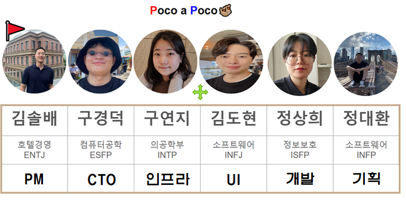
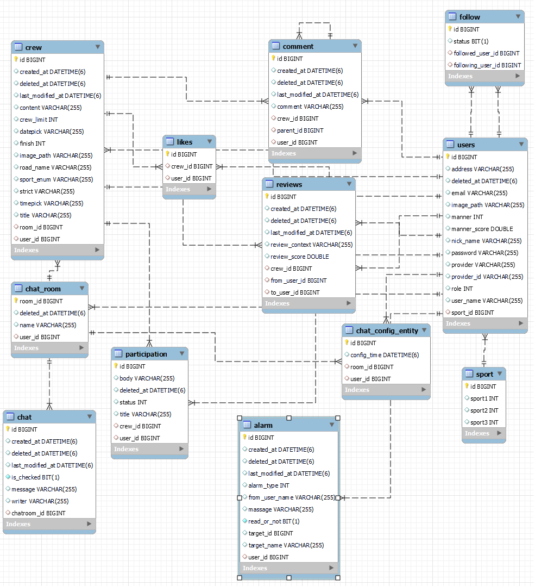

# 오늘부터 운동메💪

* **운동은 선택이 아닌 필수! 혼자가 아닌 다같이 하자~!**
* **사용자에게 쉽고 간단한 운동메이트를 찾을 수 있게 하는 서비스 제공!**
* **새로운 지역에서도 운동으로 이웃들과 친해지고 생활체육 활성화 기대!**
* **멋쟁이사자처럼🦁 백엔드스쿨 2기 팀프로젝트**

##### 
 "동네 운동 메이트를 찾아 함께 스포츠를 즐기는 서비스" 

##### 
 <a href="naver.com">오늘부터 운동메 함께하기</a> 

> * 노션페이지 : <a href="https://www.notion.so/b8ea6992ef3b4cc4896edf2079378234">팀 노션페이지</a>
> * 요구사항 명세서 : <a href="https://www.notion.so/b8ea6992ef3b4cc4896edf2079378234">요구사항 명세서</a>
> * WBS 시트 : <a href="https://docs.google.com/spreadsheets/d/1NuQwSfQaIN8C239ZupzHOgX0bKoQoHQWYkoj8PyC1Ps/edit?usp=sharing">WBS 시트</a>
> * Swagger : <a href="">스웨거</a>
     

## 📢 팀원 소개

 

 

## 🏋️‍♀️ 개발 환경

* **에디터** : Intellij Ultimate
* **개발 툴** : SpringBoot 2.7.7
* **자바** : JAVA 11
* **빌드** : Gradle
* **서버** : AWS EC2, AWS RDS, AWS S3
* **CI/CD** : Docker, Gitlab
* **데이터베이스** : MySql, Redis
* **필수 라이브러리** : Spring Data JPA, Lombok, Spring Security, thymeleaf, JWT, WebSocket, OAuth2.0, Email
* **ETC** : Git, IntelliJ, JS, KakaoMap API

 

## 🤾‍ 프로젝트 시연 영상

<a href="">오늘부터 운동메💪 시연 영상</a>

 

## 🏄‍♂ 구현 기능

#### USER

- [x] 로그인
    * ID/PW 이용한 기본 로그인 기능
    * OAuth 로그인 (구글, 네이버 로그인 기능)
    * JWT를 쿠키에 담아 인증, 인가처리 진행
    * 로그인을 통한 Refresh 토큰, Redis에 생성 및 관리
- [x] 회원가입
    * 이메일 인증을 통한 기본 회원 가입 (ID, PW, Email, 이름, 주소 등)
    * OAuth 회원가입 (구글, 네이버 회원가입 기능)
- [x] ID/PW 찾기
  - 가입한 이메일을 통해서 인증번호가 발송되며, 인증됨에 따라 PW 변경 가능

#### CREW

- [x] 크루 CRUD 기능
    - 지역별, 카테고리별 데이터를 유지하면서 원하는 게시글 조회
    - 검색어를 유지하면서 페이징 처리 기능
    - 회원에 한해서 작성 가능
    - 작성자만 수정, 삭제 가능
- [x] 크루 댓글/대댓글
  - 댓글, 대댓글 CRUD 기능
   - 회원 한해서 작성 가능
   - 작성자 한해서 수정, 삭제 가능
- [x] 크루 좋아요
    - 게시글 좋아요, 취소 기능
- [x] 상세 페이지 생성
    - 제목, 내용, 위치(카카오맵 API), 날짜(Date/TimePicker), 카테고리, 이미지 업로드(S3) 활용
- [x] 상세 페이지 조회
    - 크루 정보에 대한 상세 정보 조회
    - 이전글, 다음글 조회 기능
- [x] 크루 참여 승인/거절/반려
    - 회원은 하나의 참여하고 싶은 크루에 참여 신청을하여 승인을 받아 소속
    - 거절, 반려 시 소속 될 수 없음
- [x] 참여자 명단 조회
    - 하나의 크루에 참여한 회원들의 참여 여부를 통해 명단을 조회

#### REVIEW

- [x] 크루 종료 시 후기 평가 및 메세지 작성
    - 참여한 회원들에 한해서 상호 평가 기능 (1~5점 부여)
- [x] 온도지수 체크
    - 평가한 점수를 토대로 편차를 36.5 기준으로 점수 반영
- [x] 후기 조회
    - 크루 종료 후 작성된 후기들을 모아 볼 수 있는 기능

#### ALARM

- [x] 알림 기능
    - SSE를 통한 알림 기능 구현
    - 댓글, 대댓글, 좋아요, 팔로우, 참여 신청 및 승인, 이용자 후기, 실시간 매칭에 대한 알림이 발생

#### MATCHING

- [x] 실시간 매칭기능
    - 운동 종목별 실시간 매칭 기능
    - 매칭 성공 이후 알림처리하여 채팅방 이동 기능

#### CHAT

- [x] 실시간 채팅
    - 하나의 크루마다 실시간 채팅 기능 제공
    - 참여한 회원에 한해서 채팅방 입장 가능
- [x] 접속자 확인
    - 실시간으로 참여중인 회원정보들에 대해서 리스트에 반영
- [x] 채팅 내역 조회
    - 해당 채팅방에서 주고받은 내용들에 대해서 조회
- [x] 읽음 처리
    - 퇴장한 DateTime 기준 단체 채팅방 내 각각의 사용자에 따른 읽은 내역 제공
- [x] 채팅과 동시 크루 상세내역 제공 (카카오맵 API 적용)

#### FOLLOW

- [x] 팔로우
    - 다른 회원을 팔로우, 팔로우 취소
- [x] 팔로우 목록 조회
    - 나를 팔로우 한 유저(팔로잉), 내가 팔로우한 유저(팔로워) 조회 기능

#### MYPROFILE

- [x] 마이프로필 조회
- [x] 마이프로필 수정
    - 이름, 닉네임, 관심종목, 주소, 개인정보(이메일, 전화번호, 성별) 수정 기능 제공
- [x] 개인사진 등록
    - 개인 USER 마다 프로필 사진 등록/수정 기능
- [ ] 정보제공
  - 현재 참여중인 크루에 대한 정보 제공 기능
  - 현재 종료된 크루에 대한 정보 제공 기능
  - 받은 후기에 대해서 조회 기능

#### ADMIN

- [x] 사용자 전체 조회
    - 전체 이용자 조회, Redis에 기록된 현재 접속중인 이용자 조회
- [x] 크루 전체 관리
    - 크루 전체 조회, 삭제 기능
    - 상세페이지 내 이용자 강퇴 기능

 

## 👩‍🦯 핵심 기능 로직

### 실시간 채팅 기능
  * **SockJS를 이용한 STOMP 방식 실시간 채팅 기능**
  * 각각의 채팅방을 `/sub + id` 로 구분하여 `/pub` 메시지로 구독한 endpoint 에 채팅 전달한다.
  * 입/퇴장 시 `/pub` 메시지 를 보내 현재 `참여자 현황에 대한 최신화` 와 `채팅 내역들을 저장`하며 `읽었던 시간대를 저장` 한다
    * 참여자 현황 최신화는 컨트롤러단에서 `UserID KEY` 값으로 하고 `채팅방 ID 를 Value`로 하여 데이터에 대한 정보를 담아서 보낸다.
    * 채팅 내역들은 `/pub` 메시지 보낼때 마다 `ajax`통신을 하여 `fetch` 방식으로 저장하는 API를 호출해 해당 채팅내역을 저장한다.
  * 입장 시 해당 채팅방 내역에 대한 정보를 불러와서 사용자가 읽었던 시간대와 `비교`하여 가장 최근에 읽은 위치까지 `스크롤링` 한다.
    * 채팅방 퇴장시 현재시간을 `chat-config-entity` 에 저장하며 이후 채팅방 재입장 시 현재 시간과 비교하여 읽었던 위치를 찾는다.
### 사용자 알림 및 매칭 기능
  * **SSE를 이용한 실시간 사용자 알림 기능**
    * JavaScript 에서 페이지를 열때 SSE 서버로 연결 한다. `/sse + userId`
    * `SSE Controller` 에서 해당 UserID 에 대한 정보를 통해 새로운 `Emitter` 를 생성하며, `static Map` 에 `KEY(UserID):VALUE(emitter)` 방식으로 저장한다.
    * 해당 Emitter를 `Controller` 에서 return 해주고 `JavaScript` 에서 데이터소스로 아래 알림에 대한 `이벤트 리스너`를 등록한다.
    * 댓글, 대댓글, 좋아요, 팔로우, 참여 신청 및 승인, 이용자 후기, 실시간 매칭에 대한 알림이 발생
  * 실시간 매칭 기능
    *

### 상세 조회 및 카테고리별 조회
  * **상세 조회**
    * 상세 조회 시 먼저 CREW 가 종료되었는가 확인한다.
    * 해당 `USER` 와 `CREW`의 관계를 `PARTICIPATION` 으로 구분하여 Status를 나타낸다.
      * `0 or null` : 참여하지않음
      * `1` : 신청대기
      * `2` : 참여중
      * `3` : 종료됨
      * Status 에 따른 상세조회 페이지의 버튼이 변경된다.
    * `참여하지 않음과 신청대기` 상태에서는 크루 작성자의 참여 승인 전까지 `이용 불가`하다.
    * `참여중인 상태`에서는 채팅방 이용과 현재 참여한 `UserList` 확인할 수 있다.
    * `종료됨 상태`에서는 참여한 User에 대한 `Review` 를 남길 수 있다.
    
     
     
  * **카테고리별 운동종목별 조회 기능**
    * GET 방식으로 View 에서 `지역검색, 운동종목 선택 변수`들을 Controller 에 받는다.
    * 받은 데이터로 게시물을 조회 한다.
    * 조회 이후 유지를 위해 `View` 에 다시 검색어를 넘긴다.
      * View 에서 `검색어(지역,운동종목) 변경`이 없을 경우 넘겨 받았던 데이터를 넘기며
      * 변경이 있을 경우 변경된 데이터를 Controller 에 넘긴다.
      * 위를 반복으로 조회한다.
    * 처음 로그인시에는 유저의 `저장된 지역, 선호 운동 종목`을 찾아 `View` 에 넘긴다.
      * 검색어 유지를 하면서 `로그인 상태 변수`를 하나 만들어 false를 유지하다
      * 로그인 시 true 로 바뀌어 유저정보를 View 에 보여준다.
    
### 이미지 저장, 조회
  * **S3 를 활용한 `이미지 데이터 조회 및 저장` 기능**
  * 이미지 `업로드`
    * 이미지 이름 + 랜덤한 글자 를 KEY 로 하여 `S3`와 `DataBase`에 저장한다.
      * UUID로 진행에 따른 `crpto.uuid 인식`에 대한 문제로 인한 
      * `Math.random(20)`으로 해서 20진수로 숫자를 생성해서(0~9와 알파벳) substring 으로 `랜덤값`을 부여한다.
  * 이미지 `조회`
    * 불러오고 싶은 이미지의 KEY 를 `DataBase` 에서 조회한다.
    * JavaScript 로 사용자 확인하는 파라미터와 KEY 를 넣는다.
    * S3 에서 해당 이미지에 대한 URL을 받아 id 값을 이용해 html 에 표현한다.

 

## 🚴‍♀️ 시스템 아키텍쳐

 

## 🤸‍♀ ERD

## 🦁 ETC 

